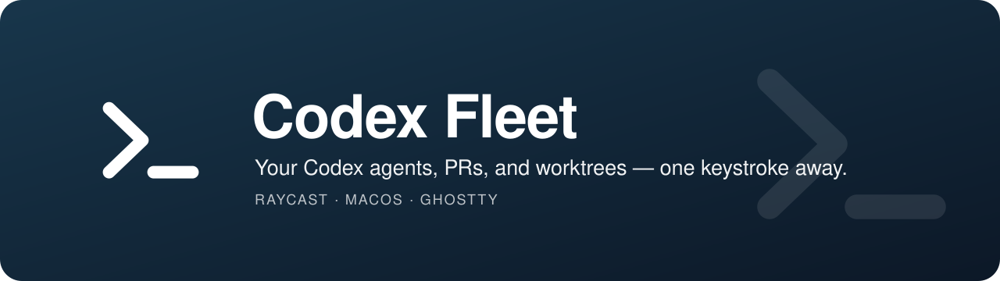
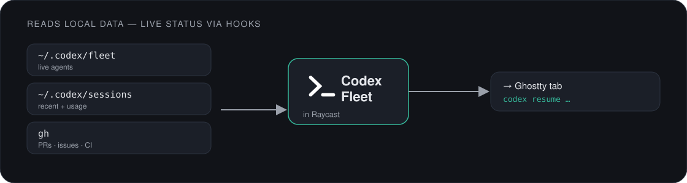

<div align="center">


See your Codex agents, PRs, and worktrees in Raycast — and hand any of them
to an agent in one keystroke. Includes a menu-bar view of who needs you.
</div>

## About this port

Codex adaptation of [vmc-7645/claude-fleet](https://github.com/vmc-7645/claude-fleet),
based on upstream commit `81dc33dd9d01561f9a72ddf6bf48397eaaceba06`.
It preserves all 14 commands, the GitHub workflows, Ghostty window affinity,
quick replies, agent handoffs, and worktree helpers. Codex-specific behavior is
outlined below; this is an independent project, unaffiliated with OpenAI.

## Commands

| Command | What it does |
|---|---|
| **Agents** | Active and recent sessions; focus, resume, fork, quick reply, close tab, interrupt, undo, delete saved session, inspect diff, copy/share handoff. Scope by repo or activity. |
| **Next Waiting Agent** | Focus the longest-waiting agent. Opt-in command; assign a hotkey. |
| **Fleet** | Menu-bar needs-you count and live roster; refreshes every minute. |
| **My PRs** | Cross-repo PRs, CI, review, Check Out & Work, and resume the latest session in the PR's local worktree. |
| **PRs to Review** | Review requests with CI and author; start a Codex review, cloning on demand. |
| **My Issues** | Open issues and start an agent with the issue context. |
| **Review PR** | Pick a repo and PR number; start Codex with a PR review prompt using `gh pr view` and `gh pr diff`. |
| **Worktrees** | Discover, open, continue, and remove worktrees; identify merged branches. |
| **Spawn Agent** | Repo + task + branch → fresh worktree and Codex session. |
| **New Session** | Fresh Codex session in a repo. |
| **MCP Servers** | Read configured servers and reported auth state; run `codex mcp login <name>`. |
| **Skills** | Edit, enable/disable, and create personal `SKILL.md` skills. |
| **Usage** | Recorded tokens by session, grouped by last activity today or earlier. |
| **Codex Config** | Edit `config.toml`, `hooks.json`, and global `AGENTS.md`; inspect hooks/plugins, select a cached model, run doctor, show version. |

## Setup

Requires macOS, Raycast, Git, GitHub CLI (`gh`), `jq`, Python 3, Node.js 22+, and
Codex CLI. The port was developed against Codex CLI **0.154.0**. Use a current CLI
with lifecycle hooks, `resume`, `fork`, `mcp list --json`, and `delete --force`.

From this repository:

```sh
helpers/install.sh
codex login
gh auth login
cd extension
npm ci
npm run dev
```

The installer puts commands in `~/.local/bin`, scripts in
`${CODEX_HOME:-~/.codex}/hooks/codex-fleet`, and merges its handlers into
`hooks.json`, backing up an existing file. It preserves unrelated handlers and
can be rerun. It does not edit `config.toml`, your shell startup files, or hook trust.
Use `helpers/install.sh --no-merge` to print the hook definitions instead.

After installation:

1. Restart Codex and use **`/hooks`** to review and trust the installed hooks.
2. Ensure `~/.local/bin` is on your terminal's PATH.
3. Enable **Raycast** in System Settings → Privacy & Security → Accessibility
   for Ghostty focus and keystroke actions.
4. Search **Codex Fleet** in Raycast. The dev extension stays installed after the dev server exits.

Hook configuration and trust follow the [official Codex Hooks guide](https://learn.chatgpt.com/docs/hooks).
CLI command mappings follow the [official command reference](https://learn.chatgpt.com/docs/developer-commands?surface=cli).

## Preferences

- **Terminal:** Ghostty (default), iTerm2, or Apple Terminal. Exact tab focus,
  quick replies, and close-tab actions use Ghostty accessibility.
- **Agent primary action:** Focus Tab or Resume in New Tab.
- **Quick replies:** Comma-separated canned follow-ups.
- **Editor command:** `code`, `cursor`, or another executable on PATH.
- **Repos directory:** Override discovery. Otherwise use
  `~/.config/codex-fleet/repos.env` (`REPO_ROOT` / `DEFAULT_REPO`) or `~/Repos`.
- **Ghostty window targeting:** Retains upstream project affinity and tab handling.

## How it works



| Source | Data |
|---|---|
| `$CODEX_HOME/fleet/*.json` | Live session state written by trusted lifecycle hooks; process start-time validation rejects stale/reused PIDs. |
| `$CODEX_HOME/sessions/**/*.jsonl` | Rollout history, user/assistant messages, turns, and cumulative token snapshots. |
| `$CODEX_HOME/state_*.sqlite` | Optional read-only summary index for newer/migrated sessions. |
| `$CODEX_HOME/session_index.jsonl` | Saved session names. |
| `$CODEX_HOME/config.toml`, `hooks.json`, `models_cache.json` | Configuration, hook inspection, and locally available model choices. |
| `~/.agents/skills`, `$CODEX_HOME/skills` | Personal skills; duplicate symlink targets are collapsed. New skills go in `~/.agents/skills`. |
| `gh`, `git` | PRs, issues, CI, branches, and worktrees. |

`CODEX_HOME` defaults to `~/.codex`. If you customize it, launch Raycast with the
same environment so the extension and CLI read the same configuration.

### Differences from the Claude version

- **Live status requires hooks.** Saved history works immediately; restart existing
  sessions after installing/trusting hooks. Recent transcript activity alone is
  never treated as proof that an agent is running.
- **App-server processes may host multiple agents.** Fleet never sends SIGINT to a
  shared app-server. Stop is available only for a verified standalone CLI process.
- **Tab titles are best-effort.** For standalone CLI sessions, the hook writes the
  status/title to the process's controlling terminal. Shared app-server sessions
  may lack a terminal and fall back to raising the terminal app.
- **PR resume resolves a local worktree and its newest matching session.** Codex
  has no `--from-pr` flag. If there is no matching session, use Check Out & Work.
- **Usage shows tokens, not dollar estimates or subscription quota.** Cached input
  and reasoning output are not counted twice. Today means sessions last updated
  today, not a reconstruction of today's billable usage.
- **MCP listing shows configuration/auth state, not a live health check.** OAuth
  login applies to servers that support it.
- **History formats are internal.** Both legacy events and newer `item_completed`
  events are supported. SQLite-only sessions can have summary metadata without
  message excerpts. Unknown/partial records are skipped.

## Handoffs

Copy a compact or full handoff card with state, context, and a resume command.
The full card includes recent messages and a diff. The explicit Share action can
create a secret (unlisted, not access-controlled) GitHub gist. Session resume IDs
refer to this machine's Codex storage; a handoff card does not transfer a session.

## Helpers and validation

See [helpers/README.md](helpers/README.md) and [SPEC.md](SPEC.md).

```sh
cd extension
npm ci
npx tsc --noEmit
npx eslint 'src/**/*.{ts,tsx}'
npx prettier --check 'src/**/*.{ts,tsx}'
npm test
npm run build
cd ..
python3 -m unittest discover -s helpers/tests -v
```

CI runs typechecking, lint, formatting, TypeScript tests, and isolated helper tests.
Automated checks do not exercise the live Raycast/Ghostty accessibility UI.

## License

[MIT](LICENSE). Original source and layouts by vmc-7645. See
[asset notices](extension/assets/NOTICE.md) for icon attribution.
